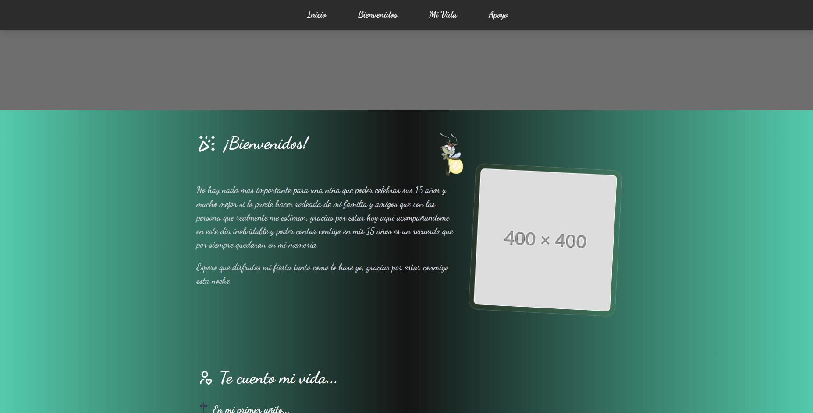

# 🎉 Event Layout & Showcase | Post-Event Thank You Page


> A highly interactive, responsive layout originally built as a post-event "Thank You" page for a Quinceañera. It features sections for the honoree's story, gratitude messages, and a showcase of the vendors who made the event possible. 
> 
> **📱 Real-World UX Context:** This page was originally accessed via a scannable QR code placed in the physical guestbook at the party, bridging the physical event and the digital digital experience for the attendees.
> 
> *Note: For privacy reasons, the original images and personal content have been removed. This repository serves to showcase the layout, frontend architecture, and technical implementation.*

🔗 **[View Live Demo Here](https://15th-party-layout-b17f57.netlify.app/)**

---

## 📸 Preview



---

## 💻 Technical Stack & Implementation

This project was built focusing on modern web development practices, clean architecture, and lightweight animations:

- **[Astro](https://astro.build/):** Chosen as the core framework to build a fast, component-based static site. It allowed for excellent HTML streaming and zero-JS-by-default architecture, maximizing performance.
- **[Tailwind CSS v4](https://tailwindcss.com/):** Used for styling and ensuring a fully responsive layout across all devices using utility-first classes.
- **[GSAP](https://gsap.com/) (GreenSock):** Implemented to handle smooth, high-performance animations that CSS alone couldn't achieve seamlessly:
  - **Page Entrance Transition:** A custom preloader and fade-in sequence when the layout mounts.
  - **Scroll-Following Element:** Using `MotionPath`, a decorative element gracefully follows the user's scroll journey throughout the page.

---

## 🧠 Architecture & Component Refactoring

One of the main challenges and learning outcomes of this project was **Component Reuse and Adaptation**. 

The base structure of this project was repurposed from a previous **Web Portfolio**. Instead of rewriting everything from scratch, I applied **Domain-Driven Naming** and structural refactoring to adapt the portfolio components into an Event Layout:

- **`Experience.astro` ➡️ `LifeTimeline.astro`:** Transformed a standard work experience timeline into a visual timeline of the honoree's life. It features a photo gallery where images open in a custom modal and can be downloaded by the guests. *(Included refactoring `ExperienceItem.astro` to `LifeItem.astro`)*.
- **`Projects.astro` ➡️ `Allies.astro`:** Adapted a traditional project grid into a vertical list showcasing the allied stores and vendors that made the event possible. I also refactored `LinkButton.astro` into `SocialButton.astro` to route users directly to the vendors' Instagram pages.
- **`Hero.astro` ➡️ `HeroEvent.astro`:** Upgraded a standard hero component into an immersive entry section featuring a smooth parallax background effect, personalized typography, and the honoree's name.
- **`AboutMe.astro` ➡️ `MessageCard.astro`:** Converted a personal bio section into a dedicated, elegant message card to thank the attendees visiting the page from the physical event.
- **Layout Separation:** Extracted the main `<HeroEvent />` component from the global `Layout.astro` and moved it into `index.astro` to ensure the layout remains truly reusable for potential multi-page scaling.

---

## ✨ Key Layout Features

1. **Parallax Hero Section:** (`HeroEvent.astro`) A striking visual entry with a dynamic parallax background effect.
2. **Scroll-Triggered Motion Path:** (`MotionPath.astro`) Powered by **GSAP**, a custom decorative element (like a firefly/butterfly) smoothly follows a mapped SVG path along the page as the user scrolls, creating a magical and immersive experience.
3. **Interactive Photo Timeline:** (`LifeTimeline.astro`) A chronological visual story featuring images integrated with a global modal (`ImageModal.astro`) that allows users to view and download memories.
4. **Allies Showcase:** (`Allies.astro`) A clean UI list acknowledging the collaborating brands, complete with direct social links.
5. **Attendee Message Card:** (`MessageCard.astro`) A warm, dedicated space to share a heartfelt "Thank You" note with the guests.


---


## 🚀 Local Development Setup

If you want to clone this layout to test the animations or adapt it for your own project:

1. Clone the repository:
   ```bash
   git clone https://github.com/Carlos13157/pagina-quince-layout.git